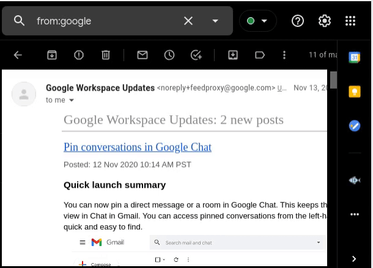
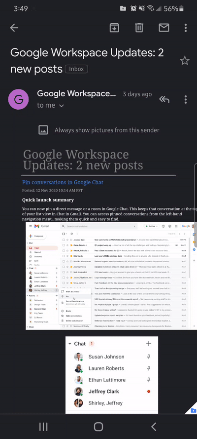
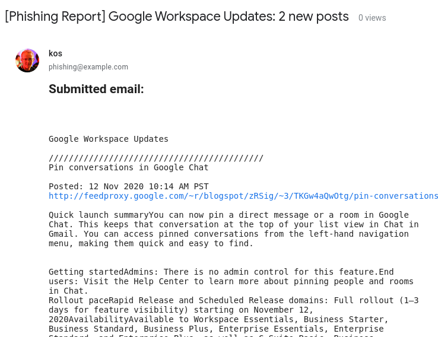

# Gmail-Phish-Addon
A Google Workspace add-on that generated phishing reports. 

Yes, I am aware of Google's Report Phish button. This was made with the intention of having similar functionality that the phish reporting browser addons have. Our in house version also integrates with our simulated phish provider to provide feedback when a user reports a simulated attack.

*This was hastly created to provide a standard cross-platform method of reporting phishing emails.*

## Reporting in the browser

## Gmail mobile app reporting

## Result
The add-on will conver the email body to plaintext (via `message.getPlainBody()`) and tack on the headers at the end of the email. The original email will also be added as an attachment.

# Installing (in dev/your profile)
- Create a new project on your [Google Apps Script dashboard](https://script.google.com/home).
- Enable manifest: `View -> Show manifest file`
- Paste the script from `Code.gs` into the `Code.gs` file in the editor.
- Save your project.

# Testing
To publish the add-on, `Publish -> Deploy from manifest`. Select `Install add-on`.

# Deploying production
To deploy this to your Google Workspace's domain, you'll need to create a [cloud project](https://console.cloud.google.com/). I do not have exact deployment details for you, you can review that on this guide: [Google Cloud Platform Projects
](https://developers.google.com/apps-script/guides/cloud-platform-projects).
